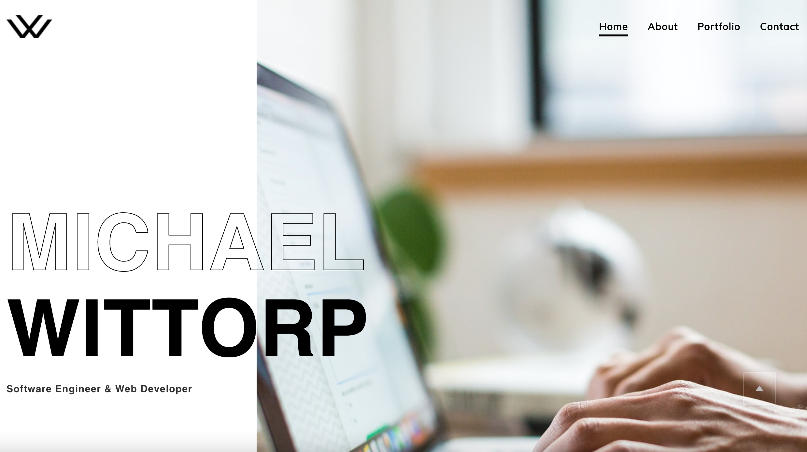
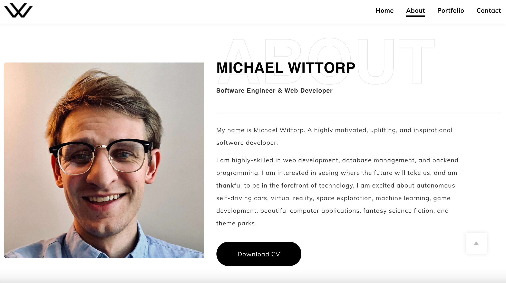
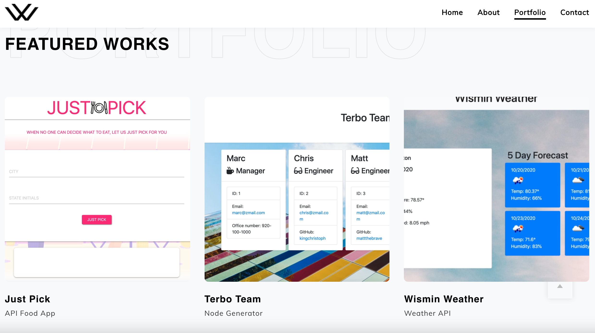

# Portfolio-React

My current and updated portfolio, in React.

## Michael Witt

Hello! My name is Michael. Welcome to my portfolio.

Full-stack web developer, digital communication specialist, and rapid prototyping professional!

I'm a UNC Chapel Hill Coding Bootcamp Student, NC State Public & Interpersonal Communication Graduate, and currently on the Rapid Cut Prototyping Sales Team. Highly skilled and well-read in many coding languages; I develop and program functional, beautiful, and intuitive websites and apps. I want to use my gifts and talents to code a better future, creating applications and software that enhances human well-being, increases and optimizes user efficiency, and develops the next hyperintelligent technology the world needs.

Thanks for stopping in! I look forward to working together to make the present and future a better place.

## Website

View my portfolio at: https://michaelwitt.github.io/Portfolio-React/

Preview: 

## Build Details

My portfolio was built using: React, JavaScript, Gatsby, HTML, CSS, and more! I formatted and stylized the website to display my bio, skillset, experience, projects, and contact links.

## Repository

View the repository at: https://github.com/MichaelWitt/Portfolio-React/

Bio: 
Projects: 

## Updates

You can find project updates in the repository, highlighting what was done to create the final product.

https://github.com/MichaelWitt/Portfolio-React/commits/

## Credits

Kalai, Annema, & You!

@Burst from Unsplash for Header Pic.

Thanks!

## Thanks For Visiting!

Come back soon :)
